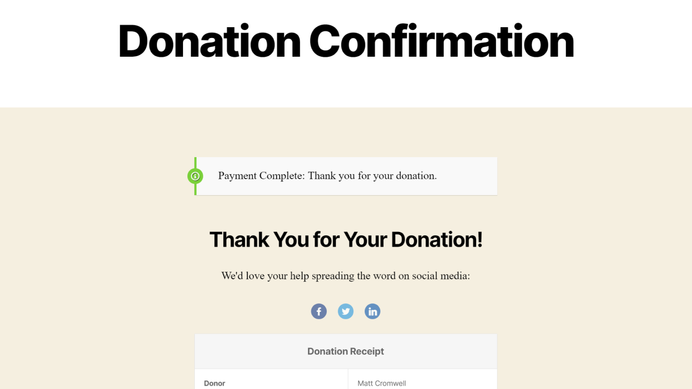

# Simple Social Shout for GiveWP

A GiveWP add-on that adds simple social sharing buttons to the Donation Confirmation page.

## Description
Let your donors share their donation experience with the world of social media. Social proof can be a powerful way to encourage more donations.

This is a simple GiveWP add-on with very few options:

<ul>
<li><strong>Social Share Title</strong> A heading above the social share buttons.</li>
<li><strong>Social Share Encouragement</strong> A paragraph below the title to encourage your donors to share their donation on social media</li>
<li><strong>Channels</strong> Checkbox list of the four supported social channels: Facebook, Twitter, LinkedIn, Pinterest</li>
<li><strong>Position</strong> Choose whether to output the social share section above or below the Donation Confirmation receipt table.</li>
</ul>

That's all you need to get up and running with this simple GiveWP add-on and start letting your donors share their donations with the world on social media.

## Frequently Asked Questions

Can I style the social share buttons?

Of course you can use CSS, but if you want more complex customization of the appearance you can add a file into your theme's root folder called `sss4givewp.php` and that will be the output of your social sharing instead. It's best if you copy the template from the plugin to start from. The default template is found in the plugin in `/templates/basic-template.php`.

I want to add X social platform; will you add it?

These three platforms each support a link-based sharing that does not require javascript or authentication -- this is why they were chosen and why this add-on is called "simple". But if you want to add additional platforms and know how to implement them correctly, see the above FAQ on how you can template the output yourself.

## Changelog
**2020-01 -- Version 1.0**

Launched version 1 with the following features:
* Settings page that includes:
    * Title
    * Message
    * Channels
    * Position
* Output is templateable
* Per form disable option 